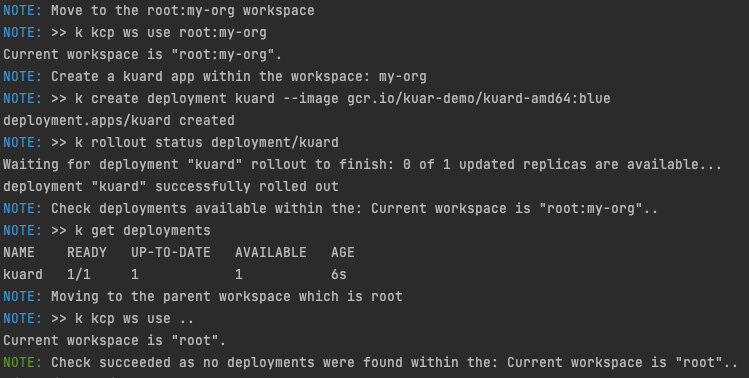

## Introduction

In order to use, play with [kcp](https://github.com/kcp-dev/kcp) it is needed to install different tools: kcp, kubectl kcp plugins and launch it.
Next, you can create workspaces and start to setup logical clusters that kcp will manage on physical clusters.

## Prerequisite

- kind is installed (if you plan to use a kind k8s cluster)
- A k8s cluster is up and running (e.g `kind create cluster`, ...)

## How to play with kcp

Different commands have been implemented in order to perform using the bash script `./kcp.sh`, the following actions:
```bash
Usage:
  ./kcp.sh <command> [args]

Commands:
    install     Install the kcp server locally and kcp kubectl plugins
    start       Start the kcp server
    stop        Stop the kcp server
    status      Check if KCP is well started
    syncer      Generate and install the syncer component top of a k8s cluster
    clean       Clean up the temp directory and remove the kcp plugins

Arguments:
    -v          Version to be installed of the kcp server. Default: `0.8.2`
    -t          Temporary folder where kcp will be installed. Default: `_tmp`
    -c          Name of the k8s cluster where syncer is installed. Default: `kind`
    -w          Workspace to sync resources between kcp and target cluster. Default: `root:my-org`
```
**Remark**: The log of the kcp server started is available at <TEMP_DIR>/kcp-output.log

To setup the demo, then execute the following commands:
```bash
kind create cluster
./kcp.sh install -v 0.8.2
./kcp.sh start
```

Next, in a second terminal, you will deploy a kcp syncer `./kcp.sh syncer -w my-org` and next run the `./demo.sh` script using the different
scenario available.

You can change the path of the project where kcp is installed like the workspace to be used, using the parameters
```bash
Usage:
  ./demo.sh <scenario> [args]

Commands:
    s1      Create a workspace, deploy an application, move one level up and verify that no deployments exist as workspaces are isolated

Arguments:
    -h      Display the help
    -t      Temporary folder where kcp is running. Default: _tmp
    -w      Workspace to be used for the demo. Default: my-org

Use $demo.sh <scenario> -h for more information about a given scenario.
```

## Scenario 1

Create a workspace, deploy an application, move one level up and verify that no deployments exist as workspaces are isolated

During the execution of this scenario `./demo.sh s1`, the following steps will be executed:



## Scenario 2

This scenario is an extension of the previous as we continue to use 1 workspace but where we would like to place the deployment on 2 distinct physical clusters. 
When we will deploy an application, it will be deployed on both clusters as kcp will use the [matching mechanism](https://github.com/kcp-dev/kcp/blob/main/pkg/apis/scheduling/v1alpha1/types_placement.go#L64-L67) to find for a placement,
its location and ultimately the syncTarget related to the [locations](https://github.com/kcp-dev/kcp/blob/main/pkg/apis/scheduling/v1alpha1/types_location.go#L32-L37) and used to sync the resources with the physical clusters.

**Warning**: As the command `kubectl kcp workload sync <cluster_name>` only create 1 `Placement` and 1 `Location` CRDs for the target cluster `<cluster_name>`,
it is then needed to perform some manual steps to create a 2nd placement and Location and to edit the `Synctarget` to use labels able to match the corresponding
resources

Example:

```yaml
apiVersion: scheduling.kcp.dev/v1alpha1
kind: Placement
metadata:
  annotations:
    kcp.dev/cluster: root:my-org
  name: blue
spec:
  locationResource:
    group: workload.kcp.dev
    resource: synctargets
    version: v1alpha1
  locationSelectors:
    - matchLabels:
        color: blue # Location Label to match
 ...       

apiVersion: scheduling.kcp.dev/v1alpha1
kind: Location
metadata:
  annotations:
    kcp.dev/cluster: root:my-org
  labels:
    color: blue
  name: blue
spec:
  instanceSelector:
    matchLabels:
      color: blue # Synctarget label to match
  resource:
    group: workload.kcp.dev
    resource: synctargets
    version: v1alpha1
```

